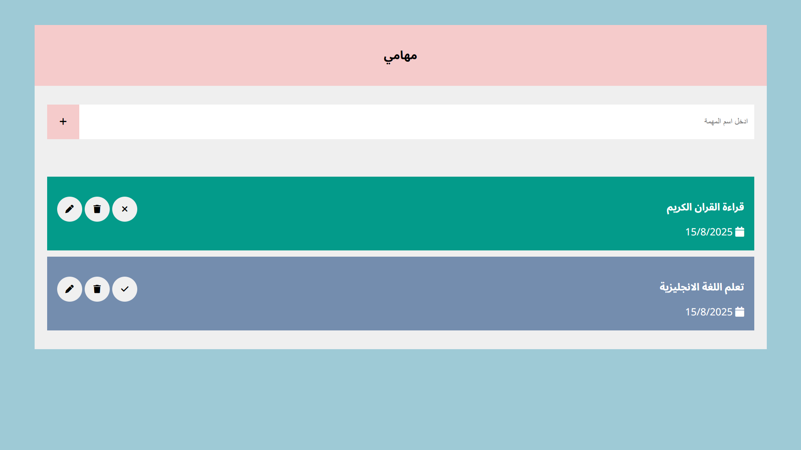

# to-do-list

# To-Do List ✅

A simple **To-Do List App** built with **HTML, CSS, and Vanilla JavaScript**.  
This project allows users to add, manage, and track their daily tasks easily.

## Features

- ➕ Add new tasks.
- 🗑️ Delete tasks.
- ✅ Mark tasks as completed (by clicking the check button).
- 📅 Automatically display task creation date.
- Responsive and clean design.

## Screenshot

## Live Demo

[Click here to view the project](https://hajarhr55.github.io/to-do-list/)

## 👩‍💻 Developer

- Hajar Al-Anazi

---

# قائمة المهام ✅

تطبيق **قائمة مهام** بسيط تم تطويره باستخدام **HTML وCSS وVanilla JavaScript**.  
يسمح للمستخدمين بإضافة وإدارة وتتبع مهامهم اليومية بسهولة.

## المميزات

- ➕ إضافة مهام جديدة.
- 🗑️ حذف المهام.
- ✅ وضع علامة صح عند إتمام المهمة (بالضغط على زر الصح).
- 📅 عرض تاريخ إنشاء المهمة تلقائيًا.
- تصميم بسيط ومتجاوب.

## لقطة شاشة

## العرض المباشر

[اضغط هنا لعرض المشروع](https://hajarhr55.github.io/to-do-list/)

## 👩‍💻 المطورة

- هاجر العنزي
